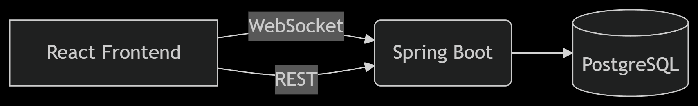

# 🃏 Duel Masters TCG - Backend System

[](https://jdk.java.net/21/)
[](https://spring.io/projects/spring-boot)
[](https://www.docker.com/)

> **Current Phase**: Backend in development (Frontend coming soon as well!)  
> A robust card game engine for Duel Masters, featuring real-time multiplayer via WebSocket and containerized microservices.


## 🚀 Implemented Features

- **Game State Management**  
  `GameState` class tracks cards, shields, and turn order
- **Real-Time Sync**  
  WebSocket broadcasts updates to all players
- **Database Integration**  
  PostgreSQL with JPA/Hibernate
- **Containerized**  
  Dockerized Spring Boot + PostgreSQL

## 🧰 Current Tech Stack

| Component           | Technology                          |
|---------------------|-------------------------------------|
| Backend             | Spring Boot 3.2 (Java 21)           |
| Database            | PostgreSQL 15                       |
| API Transport       | REST + STOMP over WebSocket         |
| Containerization    | Docker + Docker Compose             |
| **Future** Frontend | React (Coming Soon)                 |
 

## Project struct so far :
````
duel-masters/
├── backend/
│   ├── Dockerfile          # Multi-stage Java 21 build
│   └── src/
│       ├── main/java/com/duelmasters/
│       │   ├── model/      # Card, Player, GameState
│       │   ├── repository/ # JPA Repositories
│       │   └── controller/ # WebSocket + REST
│       └── resources/
│           ├── application.properties
│           └── data.sql    # Sample cards
└── docker-compose.yml      # Orchestrates services
`````
## 🐳 Running the Backend

```bash
# Start PostgreSQL + Spring Boot
docker-compose up --build

# Verify backend (in another terminal)
curl http://localhost:8080/api/cards
````
## 🛠️ Future Frontend (React) :


## Planned Features:

- Deck builder interface

- Animated card battles

- Responsive UI with TailwindCSS


